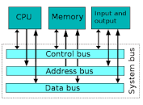

# Introduction to Computer

## Definition of Computer

A computer is an electronic device that is designed to process, store, and retrieve data. It performs calculations and executes instructions according to a set of predefined rules or programs. Computers are capable of performing a wide range of tasks, from basic calculations to complex simulations and data analysis.

## Invention of Computer

The world's first computer was invented by Charles Babbage, an English mathematician, in the 1940s. He is often referred to as the "Father of Computer." Babbage's computer, known as the Analytical Engine, was a mechanical device designed to perform various mathematical computations.

## Components of a Computer

A computer is composed of both hardware and software components:

### Hardware Components

- Central Processing Unit (CPU): The CPU is the core component of a computer that performs most of the processing and calculations.
- Memory: The memory stores data and instructions that the CPU needs to perform its tasks. It includes both primary memory (RAM) and secondary memory (hard drives, solid-state drives).
- Input Devices: These devices allow users to input data into the computer, such as keyboards, mice, and touchscreens.
- Output Devices: These devices display or present the processed information to the user, such as monitors, printers, and speakers.
- Storage Devices: These devices are used for long-term storage of data, such as hard disk drives and solid-state drives.

### Software Components

- Operating System: The operating system is a software that manages the computer's resources and provides an interface for users to interact with the computer.
- Applications: Applications are software programs that perform specific tasks or functions, such as word processors, web browsers, and games.

**Importance of Computers**

Computers have become an essential part of modern life and are used in various fields, including business, education, healthcare, entertainment, and scientific research. They have revolutionized the way we work, communicate, and access information. Computers have increased productivity, enabled complex calculations, facilitated data storage and retrieval, and opened up new possibilities in many areas of human endeavor.

**Future of Computing**

Computing technology continues to evolve rapidly, with advancements in areas such as artificial intelligence, quantum computing, and Internet of Things (IoT). These developments hold the potential to further transform the capabilities and applications of computers, paving the way for new innovations and discoveries.

## Microprocessor or CPU

**Context-1**

A microprocessor is an electronic component used by a computer to perform its work. It is a central processing unit on a single integrated circuit chip containing millions of small components, including transistors, resistors, and diodes, that work together. Microprocessors are created using semiconductor technology.

### Why do we need a computer language?
A computer language is necessary to communicate with the microprocessor and give it instructions. Since microprocessors can only understand binary code (0s and 1s), computer languages provide a higher-level and more human-readable way to write programs and commands. They allow programmers to express complex instructions and algorithms in a structured and understandable manner.

### How does it work?
The microprocessor executes instructions stored in its memory by fetching them, decoding them, and then executing the corresponding operations. It follows a fetch-decode-execute cycle, where it retrieves an instruction from memory, decodes the instruction to understand what operation needs to be performed, and then executes the operation. This cycle repeats for each instruction in a program, allowing the microprocessor to carry out the desired computations and tasks.

Overall, the microprocessor acts as the brain of the computer, performing calculations, executing instructions, and managing the flow of data within the system. It is a critical component that enables the computer to process information and perform a wide range of tasks efficiently.

**Context-2**

A microprocessor, also known as a central processing unit (CPU), is the brain of a computer system. It is a small electronic chip that performs most of the processing and calculations in a computer. The CPU is responsible for executing instructions, performing arithmetic and logical operations, and controlling the overall operation of the computer system.

### Components of a CPU

The microprocessor or CPU consists of several key components:

1. Control Unit: The control unit manages the flow of data and instructions within the CPU. It fetches instructions from memory, decodes them, and coordinates the execution of operations.

2. Arithmetic Logic Unit (ALU): The ALU performs arithmetic operations (such as addition, subtraction, multiplication, and division) and logical operations (such as comparisons and bitwise operations). It handles mathematical calculations and logical decisions.

3. Registers: Registers are small, high-speed memory units within the CPU. They store data, instructions, and intermediate results during processing. Registers have specific purposes, such as the program counter (PC) for storing the address of the next instruction to be fetched, the instruction register (IR) for holding the current instruction, and general-purpose registers for temporary data storage.

### Functioning of a CPU

The CPU operates in a fetch-decode-execute cycle:

1. Fetch: The control unit fetches the next instruction from the computer's memory, following the program counter (PC) that holds the address of the instruction.

2. Decode: The control unit decodes the fetched instruction to determine the operation to be performed.

3. Execute: The ALU carries out the necessary calculations or operations specified by the instruction. This may involve fetching additional data from memory, performing arithmetic or logical operations, and storing the results.

4. Repeat: The cycle continues, with the PC being updated to fetch the next instruction in sequence. This process repeats until all instructions in the program have been executed.

**Advancements in Microprocessors**

Over time, microprocessors have evolved to become more powerful and efficient. Advancements in semiconductor technology have allowed for smaller transistor sizes, leading to faster and more capable CPUs. Moore's Law, which states that the number of transistors on a chip doubles approximately every two years, has been a driving force behind the rapid progress in microprocessor development.

Modern microprocessors also often include multiple cores, enabling parallel processing and improved performance. Multi-core processors allow for the execution of multiple instructions simultaneously, enhancing the overall processing power of the CPU.

**Importance of the CPU**

The CPU plays a critical role in the performance and functionality of a computer system. It is responsible for executing instructions, performing calculations, and controlling the interaction between various hardware components. A powerful and efficient CPU can significantly impact the speed and responsiveness of a computer, enabling it to handle complex tasks and run demanding software smoothly.

**Future Trends**

As technology continues to advance, microprocessors are expected to become even more powerful and energy-efficient. Developments in areas such as quantum computing, neuromorphic computing, and artificial intelligence will shape the future of microprocessor design and open up new possibilities for computing capabilities.

## Types of Transistors

Devices made up of transistors are referred to as working in semiconductor technology. These devices are called semiconductor devices. A transistor is a device that regulates current or voltage flow and acts as a switch or gate for electronic signals. Transistors have three terminals: emitter, base, and collector. They can store voltages as high level (5V) and low-level (0V).

Transistors are essential electronic components used in various electronic devices and circuits. They are crucial for amplifying and switching electronic signals. There are different types of transistors available, each with its own characteristics and applications. Here are some common types of transistors:

1. Bipolar Junction Transistor (BJT):
   - NPN Transistor: In an NPN transistor, the majority charge carriers are electrons. It consists of three layers of semiconductor material: a p-type layer sandwiched between two n-type layers.
   - PNP Transistor: In a PNP transistor, the majority charge carriers are holes. It also consists of three layers: an n-type layer sandwiched between two p-type layers.

2. Field-Effect Transistor (FET):
   - Junction Field-Effect Transistor (JFET): JFETs are voltage-controlled devices. They are constructed with a doped semiconductor material that forms a channel between two terminals. The channel's conductivity is controlled by the voltage applied across the junction.
   - Metal-Oxide-Semiconductor Field-Effect Transistor (MOSFET): MOSFETs are widely used in modern electronic devices. They have a metal-oxide-semiconductor structure and operate by varying the voltage applied to the gate terminal, controlling the flow of current between the source and drain terminals.

3. Insulated Gate Bipolar Transistor (IGBT):
   - IGBTs combine the characteristics of both bipolar junction transistors (BJTs) and metal-oxide-semiconductor field-effect transistors (MOSFETs). They are used for high-power applications, such as in power electronic systems and motor control.

4. Darlington Transistor:
   - A Darlington transistor is a combination of two bipolar transistors connected in a specific configuration. It provides high current gain and is commonly used to amplify weak signals.

5. Junctionless Transistor:
   - Junctionless transistors are a recent development in transistor technology. They eliminate the need for a p-n junction in the transistor structure, simplifying the manufacturing process.

These are just a few examples of transistor types, and there are many other specialized transistors used in specific applications. Transistors are fundamental building blocks of modern electronic devices and are crucial for the operation of computers, telecommunications systems, amplifiers, and many other electronic circuits.

## Input/Output Device (I/O)

Input/Output (I/O) devices are peripheral devices connected to a computer system that facilitate communication between the computer and the outside world. These devices allow users to input data into the computer for processing or receive output from the computer.

### Types of Input Devices
- Keyboard: A device used to input text, numbers, and commands into the computer by pressing keys.
- Mouse: A pointing device that allows users to control the cursor on the computer screen.
- Scanner: A device that converts physical documents or images into digital format for computer processing.
- Microphone: An audio input device that captures sound and allows users to record audio or input voice commands.
- Webcam: A video input device that captures video and allows users to participate in video conferences or record videos.

### Types of Output Devices
- Monitor: A display device that presents visual output from the computer, including text, images, and videos.
- Printer: A device that produces hard copies of documents or images from the computer.
- Speaker: An audio output device that plays sound or music generated by the computer.
- Projector: A device that projects computer-generated images or videos onto a larger screen or surface.

### Importance of I/O Devices
I/O devices play a crucial role in the interaction between users and computers. They enable users to input commands, data, and instructions into the computer, and they provide output in the form of text, graphics, sound, or other media. Without I/O devices, computers would be limited in their ability to communicate with users and the external environment.

### I/O Interface
To facilitate communication between the computer and I/O devices, an I/O interface is used. The interface acts as a bridge, translating the electrical signals and data between the computer's internal components and the connected I/O devices. Different types of interfaces are used for various I/O devices, such as USB (Universal Serial Bus), HDMI (High-Definition Multimedia Interface), and Ethernet.

### Examples of I/O Devices
- Keyboard and mouse combo: These devices are commonly used for inputting commands and interacting with the computer.
- Printer-scanner combo: This device allows both printing and scanning functions, providing versatile capabilities for document handling.
- Touchscreen display: This input/output device combines the functionality of a display and a touch-sensitive interface, allowing users to interact directly with the computer screen.
- External hard drive: An I/O device used for storing and retrieving data externally from the computer system.

I/O devices greatly enhance the usability and functionality of computer systems, allowing users to interact with computers and access information in various forms.

## HLL, ALL & MLL: Assembler and Compiler

In the context of computer programming, different levels of languages and tools are used to develop software. Let's explore the concepts of High-Level Languages (HLL), Assembly-Level Languages (ALL), and Machine-Level Languages (MLL), as well as the role of assemblers and compilers in the software development process.

### High-Level Language (HLL)

High-Level Languages are programming languages that are designed to be more human-readable and user-friendly compared to lower-level languages. They provide a higher level of abstraction and allow programmers to write code using familiar syntax and logical constructs. Examples of high-level languages include C, C++, Java, Python, and many others.

HLLs offer various features and abstractions, such as data types, control structures (loops, conditionals), functions, classes, and libraries. They enable programmers to focus on solving problems at a higher level of abstraction without worrying about the underlying hardware details.

### Assembly-Level Language (ALL)

Assembly-Level Language, also known as assembly language, is a low-level programming language that is specific to a particular computer architecture. It is a human-readable representation of machine code instructions, where each assembly instruction corresponds to a machine instruction.

Assembly language provides a one-to-one mapping to machine instructions and allows programmers to have more control over the hardware resources. It uses mnemonic codes and symbolic names to represent machine instructions and memory addresses, making it easier for programmers to understand and write code compared to machine language.

### Machine-Level Language (MLL)

Machine-Level Language, also known as machine code, is the lowest level of programming language understood by computers. It consists of binary instructions that are directly executed by the computer's hardware. Machine code is specific to the processor architecture and represents the actual sequence of bits that the CPU can understand and execute.

Machine-level programming requires a deep understanding of the underlying hardware and instruction set architecture. It is complex and tedious to write and read machine code instructions directly.

### Assembler

An assembler is a software tool used to convert assembly language code into machine code. It translates the symbolic representations of assembly instructions and memory addresses into their binary equivalents. The assembler also resolves references to memory locations and labels, generating executable machine code that can be directly executed by the computer.

Assemblers play a vital role in the development of software at the assembly language level. They bridge the gap between human-readable assembly code and machine code, making it easier for programmers to write efficient low-level code.

### Compiler

A compiler is a software tool that translates high-level language code (such as C, C++, Java) into machine code or assembly code. It takes the entire program as input, analyzes the code, performs optimizations, and generates executable machine code or assembly code.

Compilers perform various tasks, including lexical analysis, syntax analysis, semantic analysis, code optimization, and code generation. They enable programmers to write code in high-level languages and benefit from their abstraction and expressiveness while generating efficient machine code that can be executed by the computer.

Compilers play a crucial role in software development, as they allow programmers to write code at a higher level of abstraction and facilitate portability across different platforms.

In summary, High-Level Languages (HLL) provide a higher level of abstraction and readability for programmers, Assembly-Level Languages (ALL) bridge the gap between human-readable code and machine code, and Machine-Level Languages (MLL) represent the lowest level of programming understood by computers. Assemblers and compilers are essential tools in translating code from higher-level languages to lower-level machine code or assembly code.

In the view of software engineers, microprocessors can store either 5V or 0V. From a programming perspective, these levels are often seen as low level ('0') and high level ('1').

- Machine Level Language: Initially, programming for the first computer was a complex task because microprocessors only understood 0s and 1s. Programmers had to remember the combinations of 0s and 1s to perform operations like addition and subtraction. This code is called "Machine Level Language" or "Low-Level Language."

- Assembly Level Language: In the 1950s, it was decided to change the approach of writing long sequences of 0s and 1s. Instead, a single instruction could be given, which led to the development of "Assembly Level Language." This language used words or names in English forms instead of numbers.

- High-Level Programming Language: In the 1960s, the concept of "High-Level Programming Language" emerged. These languages are closer to human language, enabling programmers to focus on problem-solving rather than dealing with low-level details.

## Storage Devices

A storage device is a hardware component used for storing and retrieving data files and objects. It provides the means to store data both temporarily and permanently. Let's explore some common storage devices:

### Random Access Memory (RAM)

Random Access Memory, commonly known as RAM, is a type of volatile memory used by computers to temporarily store data that is actively being used by the processor. It provides fast access to data, allowing the CPU to read and write data quickly. However, RAM requires a constant supply of electricity to retain the stored data. Once the power is disconnected, the data in RAM is lost. RAM is typically used to store the operating system, applications, and data during the computer's operation.

### Read-Only Memory (ROM)

Read-Only Memory, or ROM, is a type of non-volatile memory that stores data permanently. It contains pre-programmed instructions or data that cannot be modified or erased by normal computer operations. ROM retains its contents even when the power is turned off. It is commonly used to store firmware, such as the computer's BIOS (Basic Input/Output System), which provides low-level system functionality.

### Hard Disk Drive (HDD)

A Hard Disk Drive, often referred to as an HDD, is a non-volatile storage device that uses magnetic storage to store and retrieve digital data. It consists of rotating disks (platters) coated with a magnetic material and read/write heads that move over the disk surfaces to access the data. HDDs provide large storage capacities and are commonly used for long-term data storage in computers, servers, and external storage devices.

### Solid-State Drive (SSD)

A Solid-State Drive, also known as an SSD, is a non-volatile storage device that uses flash memory to store and retrieve data. Unlike HDDs, SSDs do not have moving parts, which makes them faster, more durable, and less susceptible to mechanical failures. SSDs have become increasingly popular in recent years due to their faster read and write speeds, making them ideal for improving system performance.

### Optical Discs

Optical discs, such as CDs (Compact Discs), DVDs (Digital Versatile Discs), and Blu-ray discs, are storage media that use laser technology to read and write data. They have relatively large storage capacities and are commonly used for distributing software, music, movies, and other multimedia content. Optical discs are read-only (CD-ROM, DVD-ROM) or read-write (CD-RW, DVD-RW) depending on their capabilities.

### Flash Drives

Flash drives, also known as USB drives, thumb drives, or pen drives, are portable storage devices that use flash memory to store data. They connect to computers and other devices via USB ports and provide a convenient and portable way to carry and transfer data. Flash drives are compact, durable, and have become a popular choice for data storage and transportation.

### Cloud Storage

Cloud storage refers to online storage services that allow users to store and access data over the internet. Users can upload their files to remote servers managed by a cloud storage provider, and the data can be accessed from any device with an internet connection. Cloud storage offers scalability, flexibility, and remote accessibility, making it a convenient solution for storing and sharing data.

These are just a few examples of storage devices commonly used in computer systems. Each type of storage device has its own characteristics, advantages, and limitations, and the choice of storage device depends on factors such as data storage requirements, speed, reliability, and cost.

Here, the requirement for a permanent storage device arises to store data or programs, which is fulfilled by the use of a Hard Disk.

|  Components     | ADVANTAGES                 | DISADVANTAGES          |
|-----------------|----------------------------|------------------------|
| RAM             | Fast, Compact              | Expensive, Volatile    |
| ROM             | Cheap, Slow                | Non-Volatile           |
| Magnetic Tape   | Large storage capacity     | Costly, Low speed      |
| Optical Disc    | High Speed Read/Write      | Small Capacity         |
| CDROM           | Medium Size, Portable      | Not Durable            |
| Floppy Diskette | Very cheap, portable       | Less than half a MB    |
| Flash Drive     | Lightweight, small size    | Short life span        |
| DVD             | Bigger in terms of space   | More expensive to store |
| Blueray         | Better quality video output|                         |

## Bus Connection

The collection of instructions, known as code or programs, needs to be stored somewhere since microprocessors cannot store them. This requirement is fulfilled by storage devices such as the "Hard Disk." The connection between the hard disk and microprocessor is achieved through a bunch of wires called "Bus Connection." However, due to different technologies used by the hard disk and microprocessor, this communication process can be slow.

- Microprocessor: Works on the principle of semiconductor technology based on current and voltage.
- Hard Disk: Works on the principle of magnetism, based on magnetic tapes.

In computer architecture, a bus refers to a communication pathway that allows different components of a computer system to exchange data and signals. It serves as a connection between various hardware devices, enabling them to interact and transfer information. One crucial aspect of bus connection is the transfer of instructions and data between the microprocessor (CPU) and other hardware components.

### How it Works

The bus connection consists of a set of electrical wires that carry signals and data between the CPU and other devices. It acts as a communication highway, facilitating the transfer of information in both directions. The CPU sends instructions to other devices via the bus, and these devices respond by sending back data or performing the required operations.

The bus connection operates on the principle of parallel communication, where multiple bits of data are transferred simultaneously. It enables faster and efficient data transfer between the CPU and peripherals, such as memory, input/output devices, and storage devices.

### Types of Bus

There are several types of buses in a computer system:

1. Address Bus: It carries the address information from the CPU to memory or other devices. It specifies the location in memory or device registers where data needs to be read from or written to.

2. Data Bus: It is responsible for transferring data between the CPU and memory or devices. The data bus carries the actual information being processed, such as program instructions or user data.

3. Control Bus: The control bus carries control signals that coordinate and regulate the operation of different components in the computer system. It includes signals like read, write, interrupt, clock, and reset signals.

### Bus Width

The bus width refers to the number of bits that can be transferred simultaneously over the bus. A wider bus allows for the transfer of more data in a single cycle, resulting in faster data transfer rates. The bus width is an important factor in determining the overall performance of the computer system.

### Bus Speed

The bus speed, also known as the bus clock frequency, indicates how fast the data can be transferred on the bus. It is measured in megahertz (MHz) or gigahertz (GHz) and represents the number of cycles per second. A higher bus speed allows for faster data transfer and better overall system performance.

### Diagrammatic Representation

Here is a diagram illustrating the bus connection in a computer system:

The bus connection is a vital component of computer organization, enabling efficient communication and data transfer between the CPU and other hardware devices. It plays a crucial role in ensuring the smooth operation of the computer system by facilitating the exchange of instructions, data, and control signals. Understanding the bus connection helps in designing and optimizing computer architectures for improved performance and functionality.

## Operating System

An operating system (OS) is a software program that manages and controls the hardware and software resources of a computer system. It acts as an intermediary between the computer user and the computer hardware, providing an environment for running applications and executing tasks efficiently. The operating system performs various essential functions, including:

1. Process Management: It manages and schedules the execution of processes or programs running on the computer system. The operating system allocates system resources, such as CPU time, memory, and input/output devices, to different processes, ensuring fairness and efficient utilization.

2. Memory Management: The operating system manages the computer's memory hierarchy, allocating and deallocating memory space to processes as required. It keeps track of memory usage, handles memory fragmentation, and ensures efficient memory utilization.

3. File System Management: It provides a hierarchical structure for organizing and storing files on storage devices, such as hard drives or solid-state drives. The operating system handles file operations, such as creation, deletion, reading, and writing, and manages file access permissions and security.

4. Device Management: The operating system manages the computer's input and output devices, including keyboards, mice, printers, disk drives, and network interfaces. It handles device drivers, provides an interface for device communication, and ensures proper device allocation and utilization.

5. User Interface: The operating system provides a user-friendly interface that allows users to interact with the computer system. It can have different types of interfaces, such as a command-line interface (CLI) or a graphical user interface (GUI), providing features like file management, application launching, and system configuration.

6. Security: The operating system implements various security mechanisms to protect the computer system from unauthorized access, data breaches, and malicious software. It includes user authentication, access control, encryption, and virus/malware detection and prevention.

7. Networking: In modern computer systems, the operating system includes networking capabilities to enable communication and data transfer between different computers and devices. It manages network connections, protocols, and provides networking services like file sharing, remote access, and internet connectivity.

### Types of Operating Systems

There are several types of operating systems, including:

1. Single-User, Single-Tasking: These operating systems support only one user and allow running one task or program at a time. They are simple and commonly found in embedded systems or older computer systems.

2. Single-User, Multi-Tasking: These operating systems support one user but can run multiple tasks or programs concurrently. They provide multitasking capabilities, allowing users to switch between different applications.

3. Multi-User: These operating systems support multiple users simultaneously. They have robust user management and access control mechanisms, enabling multiple users to work on the same computer system concurrently.

4. Real-Time: Real-time operating systems are designed for systems that require precise timing and quick response to external events. They are commonly used in industrial control systems, robotics, and embedded systems.

5. Network: Network operating systems are designed for computer networks, providing centralized management and coordination of network resources and services. They facilitate file sharing, printer sharing, and network administration.

6. Mobile: Mobile operating systems are specifically designed for mobile devices, such as smartphones and tablets. They provide optimized user interfaces, power management, and support for mobile applications.

The operating system is a fundamental component of any computer system, providing essential functions for managing hardware and software resources, facilitating user interaction, and ensuring system efficiency and security. Different types of operating systems cater to various computing environments, each with its own set of features and capabilities.

## Applications

Applications, also known as software or programs, are a crucial component of computer systems that allow users to perform specific tasks and utilize the capabilities of the hardware. Applications can range from simple utilities to complex software packages, serving various purposes and catering to different user needs. Here are some common types of applications:

1. Word Processing Applications: These applications are used for creating, editing, and formatting text documents. Examples include Microsoft Word, Google Docs, and LibreOffice Writer.

2. Spreadsheet Applications: Spreadsheet applications enable users to perform calculations, create tables, and analyze data. Microsoft Excel, Google Sheets, and LibreOffice Calc are popular examples.

3. Presentation Applications: Presentation applications allow users to create and deliver multimedia presentations. Microsoft PowerPoint, Google Slides, and LibreOffice Impress are widely used for this purpose.

4. Web Browsers: Web browsers are applications that enable users to access and browse the internet. Commonly used web browsers include Google Chrome, Mozilla Firefox, and Microsoft Edge.

5. Email Clients: Email clients are applications used for managing and sending emails. Examples include Microsoft Outlook, Gmail, and Mozilla Thunderbird.

6. Graphics Editing Applications: Graphics editing applications are used for creating and manipulating visual content. Adobe Photoshop, GIMP, and CorelDRAW are popular choices in this category.

7. Media Players: Media players allow users to play audio and video files. Some well-known media players include VLC Media Player, Windows Media Player, and iTunes.

8. Database Management Systems: Database management systems are applications used for storing, organizing, and managing large amounts of structured data. Examples include MySQL, Oracle Database, and Microsoft SQL Server.

9. Video Editing Applications: Video editing applications provide tools for editing and enhancing video footage. Adobe Premiere Pro, Final Cut Pro, and DaVinci Resolve are widely used by professionals in this field.

10. Gaming Applications: Gaming applications are designed for entertainment purposes, providing interactive and immersive gaming experiences. Popular gaming platforms include Steam, PlayStation, and Xbox.

These are just a few examples of the countless applications available across various domains. Each application serves a specific purpose and utilizes the capabilities of the underlying hardware to deliver its functionality.

